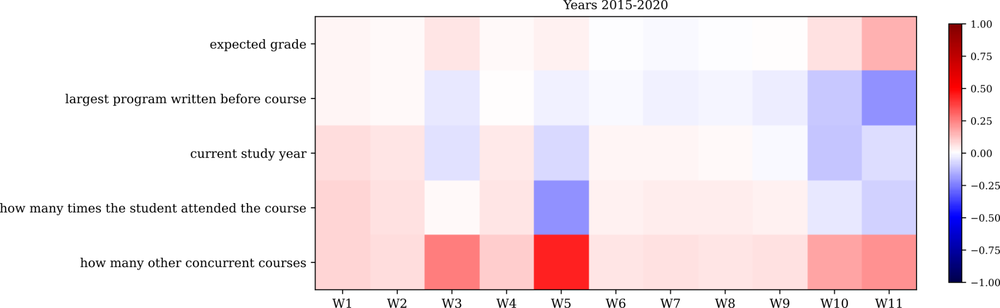
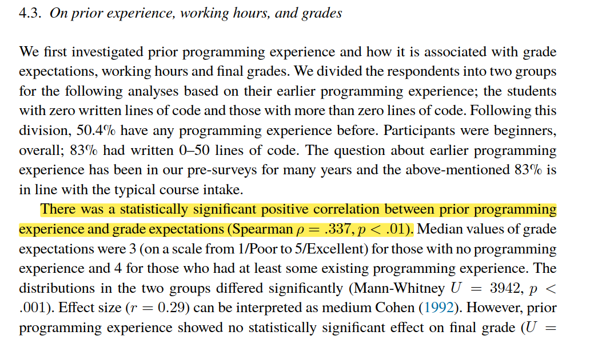
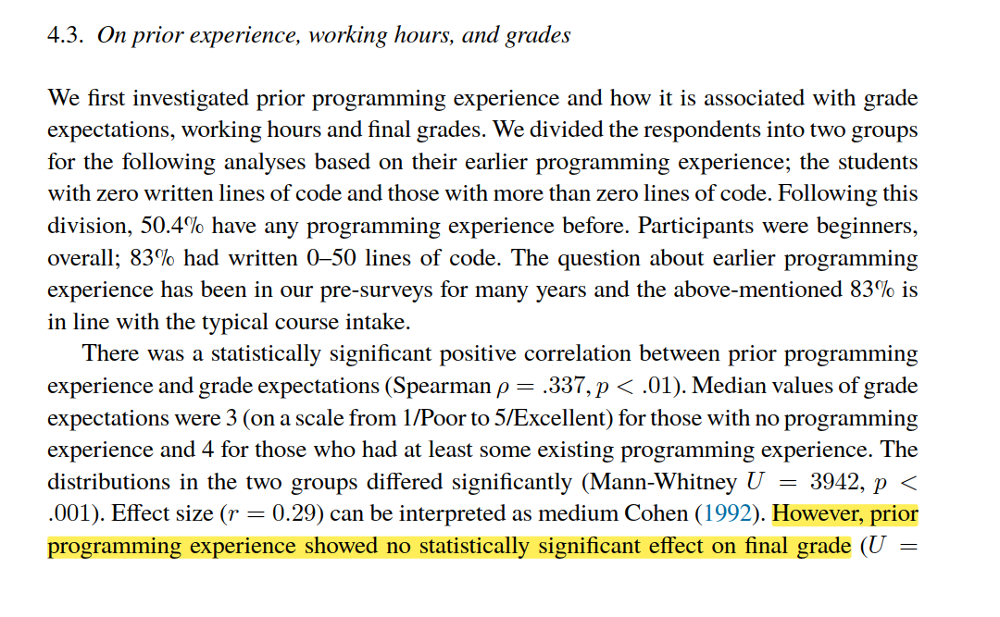
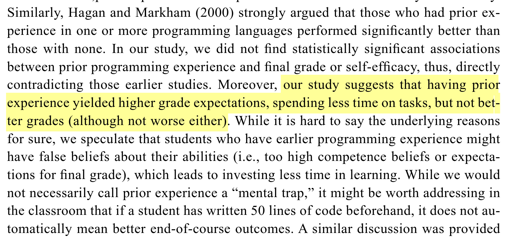

     1|---
     2|theme: slidev-theme-jyu
     3|addons:
     4|  - slidev-addon-polls
     5|title: "Ohjelmointi 1 – Luento 1"
     6|download: false
     7|favicon: https://jyu-polls.dezhidki-hermes.party/jyu-logo-cover.svg
     8|pollQr: "https://jyu-polls.dezhidki-hermes.party/vote.html"
     9|layout: cover
    10|---
    11|
    12|# Ohjelmointi 1 – Luento 1
    13|
    14|Kurssibyrokratia, ensimmäinen ohjelma
    15|
    16|*24.6.2024*
    17|
    18|---
    19|
    20|# Luennon ohjelma
    21|
    22|> Tervetuloa opiskelemaan ohjelmointia!
    23|
    24|- Henkilökunnan esittely
    25|- Kurssin rakenteet, osaamistavoitteet ja materiaali
    26|- Työmäärä ja opiskelutavat
    27|- Suoritustavat ja arviointi
    28|- Mistä saa apua?
    29|- Ensimmäinen ohjelma
    30|- Mitä seuraavaksi?
    31|
    32|---
    33|layout: two-cols
    34|---
    35|
    36|# Esitietokysely
    37|
    38|::left::
    39|
    40|- https://tim.pm/ohj1-esikysely
    41|
    42|::right::
    43|
    44|
    45|
    46|---
    47|
    48|# Vastuuopettajat ja tuntiopettajat
    49|
    50|- Opettajat
    51|  - Denis Zhidkikh
    52|  - Antti-Jussi Lakanen
    53|- Tuntiopettajat
    54|  - Tatu Kauhanen
    55|  - Jimi Kortelainen
    56|  - Henri Kärkkäinen
    57|  - Konsta Lahtinen
    58|  - Karel Parkkola
    59|  - Roosa Parkkola
    60|  - Toni Pietiläinen
    61|  - Rauli Ruokokoski
    62|  - Santtu Salo
    63|  - Karri Sormunen
    64|  - Noora Pura
    65|
    66|---
    67|
    68|# Sisältö ja päätavoitteet
    69|
    70|- Ohjelman suunnittelu
    71|- C#-kielen perusteet
    72|- Virheiden jäljittäminen ja korjaaminen (debuggaus 🔍🐛)
    73|- Rakenteinen ohjelmointi (structured programming)
    74|  - Tietokoneen toimintaa ohjataan käyttämällä
    75|    - ehtoja (esim. jos a, niin b)
    76|    - toistoja (esim. tee x, kunnes y)
    77|    - koodia ryhmitteleviä lohkoja
    78|    - aliohjelmia aka funktioita
    79|- Perustietorakenteet
    80|- Harjoitustyönä peli
    81|  - myös lukuisissa harjoitustehtävissä tutkitaan peleistä tuttuja ongelmia
    82|  - pelien kautta harjoitellaan yleistä ohjelmointitaitoa
    83|
    84|---
    85|
    86|# Useimmin kysyttyjä kysymyksiä
    87|
    88|- Miksi C# ohjelmointikieli?
    89|  - Jotakin kieltä on käytettävä :-)
    90|  - C# on moderni kieli ja soveltuu monen tyyppisiin sovelluksiin
    91|  - Ohjelmointi 1 on kuitenkin ensisijaisesti ohjelmointikurssi, ei C#-kurssi
    92|- Miksi kurssi keskittyy pääsääntöisesti peleihin?
    93|  - Kurssi ei keskity pääsääntöisesti peleihin
    94|  - Peliteema (erityisesti harjoitustyössä) motivoi ja antaa sijaa luovuudelle. Harkkatyönä voi tehdä myös muun sovelluksen.
    95|
    96|---
    97|
    98|# Kurssimateriaalit ja opetusmuodot
    99|
   100|- Luennot 2 x viikko
   101|- Harjoitustehtävät
   102|- Kurssimoniste
   103|- Harjoitustyö
   104|- Kurssisivut: https://tim.pm/ohj1
   105|- Itsenäinen työskentely
   106|  - moniste
   107|  - harjoitustehtävät
   108|  - harjoitustyö
   109|- Ryhmäohjaukset ja yksilöohjaukset
   110|- Harjoitustehtävien läpikäyntitilaisuus
   111|
   112|---
   113|class: dense
   114|---
   115|
   116|# Suoritustavat ja arviointi
   117|
   118|- Tapa 1
   119|  - Kaikki pakolliset harjoitustehtävät (ns. “tähtitehtävät”)
   120|  - Vähintään 27 pistettä harjoitustehtävistä
   121|  - Harjoitustyö
   122|  - Debuggausnäyte
   123|  - Arvosana määräytyy tentistä; tenttiin saa hyvityspisteistä tehtyjen harjoitustehtävien perusteella
   124|- Tapa 2
   125|  - Kaikki pakolliset harjoitustehtävät (ns. “tähtitehtävät”)
   126|  - Vähintään 5 pistettä harjoitustehtävistä jokaiselta harjoitustehtäväkerralta
   127|  - Harjoitustyö
   128|  - Debuggausnäyte
   129|  - Arvosanaksi tulee 1 (ei tenttiä)
   130|
   131|---
   132|layout: two-cols
   133|---
   134|
   135|# Sallitut ja kielletyt asiat
   136|
   137|::left::
   138|
   139|**Sallittua**
   140|
   141|- Ryhmätyöskentely
   142|- Palautteen ja avun pyytäminen
   143|
   144|::right::
   145|
   146|**Kiellettyä**
   147|
   148|- Toisen tekemän koodin kopiointi itselle
   149|- Itse tehdyn koodin antaminen toiselle
   150|- Vanhojen vastausten käyttö
   151|- (Vilppitapausten käsittely.)
   152|
   153|---
   154|layout: two-cols
   155|class: denser
   156|---
   157|
   158|# Sallitut ja kielletyt asiat: tekoälyn käytöstä
   159|
   160|::left::
   161|
   162|**Sallittua**
   163|
   164|- Ohjelmointiin yleisesti liittyvien asioiden kysyminen
   165|- Palautteen kysyminen itse generoidusta koodista (kunhan et käytä mahdollisesti AI:n generoimaa, korjattua koodia)
   166|
   167|::right::
   168|
   169|**Kiellettyä**
   170|
   171|- Harjoitustehtävien vastausten generointi
   172|- Kokonaan kielletty tentissä (koskee myös IDE:n AI-plugineja)
   173|- Tämä on myös vilppiä
   174|
   175|> Miten voit pysyä tekoälyä parempana, jos ulkoistat ajattelemisesi sille?
   176|
   177|> AWS CEO says using AI to replace junior staff is 'Dumbest thing I've ever heard'2
   178|
   179|> 1Kosmyna et al., 2025, Your Brain on ChatGPT: Accumulation of Cognitive Debt when Using an AI Assistant for Essay Writing Task△
   180|
   181|> 2https://www.theregister.com/2025/08/21/aws_ceo_entry_level_jobs_opinion/
   182|
   183|> Suora tekoälyn hyödyntäminen haittaa oppimista1
   184|
   185|---
   186|
   187|# Mistä saa apua?
   188|
   189|- Ohjaukset 14.1. - 24.4.2026 (ei pääsiäistauolla)
   190|  - Lähiohjaukset Agoran mikroluokissa Sovjet ja Finland: ke 8-18, to 8-18, pe 8-14
   191|  - Etäohjaukset Teams-kanavalla
   192|  - Ajat saattavat muuttua kysynnän mukaan, ks. kurssin etusivu
   193|- Kysymykset ja vastaukset: https://tim.pm/ohj1-qa
   194|- Opettajien sähköpostilista: ohj1-opet@jyu.onmicrosoft.com
   195|
   196|---
   197|
   198|# Työmäärästä ja opiskelutavasta
   199|
   200|- Opintojakson laajuus on 6 op ≈ 160 tuntia (1 op ≈ 27 tuntia), kesto 11 viikkoa
   201|- Suositeltu työmäärä on 14,5 tuntia/viikko:
   202|
   203|
   204|
   205|---
   206|
   207|# Työmäärästä ja opiskelutavasta
   208|
   209|- TOP 5 parhaiten läpipääsyn kanssa korreloivaa tekijää (vuosina 2015-2020):
   210|- Oikein tehtyjen harjoitustehtävien määrä ennen takarajaa
   211|- Harjoitustehtävien tekemisen aktiivisuus viikolla 4
   212|- Harjoitustehtävien tekemisen aktiivisuus kaikilla viikoilla
   213|- Oikein tehtyjen harjoitustehtävien määrä viikolla 1
   214|- Oikein tehtyjen harjoitustehtävien määrä viikolla 3
   215|- TOP 5 parhaiten pudokkuuden kanssa korreloivaa tekijää (vuosina 2015-2020):
   216|- Tekemättömien harjoitustehtävien määrä
   217|- Vastausyritysten lukumäärä yksittäisessä harjoitustehtävässä viikolla 2
   218|- Tehtävien palauttaminen hyvin lähellä takarajaa viikolla 4
   219|- Tekemättömien harjoitustehtävien määrä viikolla 6
   220|- Palautettujen harjoitustehtävien lukumäärä 5 minuutin sisällä viikolla 3
   221|
   222|> Zhidkikh et al. (2024): Reproducing Predictive Learning Analytics in CS1: Toward Generalizable and Explainable Models for Enhancing Student Retention. Journal of Learning Analytics, 11(1), 132-150. https://doi.org/10.18608/jla.2024.7979
   223|
   224|---
   225|
   226|# Työmäärästä ja opiskelutavasta
   227|
   228|- Opiskelijan kokemukset, taustat ja läpipääsyennuste
   229|
   230|> Zhidkikh et al. (2024): Reproducing Predictive Learning Analytics in CS1: Toward Generalizable and Explainable Models for Enhancing Student Retention. Journal of Learning Analytics, 11(1), 132-150. https://doi.org/10.18608/jla.2024.7979
   231|
   232|---
   233|
   234|# Työmäärästä ja opiskelutavasta
   235|
   236|
   237|
   238|> Lakanen, A., & Isomöttönen, V. (2023). CS1: Intrinsic Motivation, Self-Efficacy, and Effort. Informatics in Education, 22(4), 651-670. https://doi.org/10.15388/infedu.2023.26
   239|
   240|---
   241|
   242|# Työmäärästä ja opiskelutavasta
   243|
   244|
   245|
   246|> Lakanen, A., & Isomöttönen, V. (2023). CS1: Intrinsic Motivation, Self-Efficacy, and Effort. Informatics in Education, 22(4), 651-670. https://doi.org/10.15388/infedu.2023.26
   247|
   248|---
   249|
   250|# Työmäärästä ja opiskelutavasta
   251|
   252|> Lakanen, A., & Isomöttönen, V. (2023). CS1: Intrinsic Motivation, Self-Efficacy, and Effort. Informatics in Education, 22(4), 651-670. https://doi.org/10.15388/infedu.2023.26
   253|
   254|
   255|
   256|---
   257|
   258|# Työmäärästä ja opiskelutavasta
   259|
   260|- Yhteenvetona
   261|- Aseta itsellesi tavoite (erityisesti sivuaineopiskelijat): miksi opiskelet ohjelmointia?
   262|- Sitoudu kurssin suorittamiseen heti – harjoitustehtävät ja ohjaukset ovat sinua varten
   263|- On OK, että ei ymmärrä kaikkea heti – palastele, kokeile, kertaa, kysy
   264|- Älä jää hakkaamaan päätä seinään (liikaa) – ryhmäohjaukset ja opettajat ovat apuna
   265|- Ei ole yhtä samaa polkua oppimiseen – kokeile monipuolisesti kaikkia resursseja
   266|
   267|---
   268|
   269|# Mitä ohjelmoinnilla voi tehdä?
   270|
   271|

   272|  
   273|  
   274|  
   275|  
   276|  
   277|

   278|
   279|---
   280|
   281|# Mitä ohjelmointi on?
   282|
   283|- Ohjelmointi on prosessi, jossa tuotetaan ohje, joka voidaan antaa tietokoneelle suoritettavaksi
   284|  - Tekninen luonnehdinta
   285|- Ohjelmointi tarkoittaa luovaa ongelmanratkaisua, jonka avulla voidaan ratkaista arkipäivän ongelmia tai suunnitella uusia palveluja – siten, että ratkaisun saa tietokoneella suoritettua
   286|  - Konstruktiivinen luonnehdinta
   287|- Tämän kurssin tavoite: Ymmärtää sekä teknistä että konstruktiivista luonnehdintaa
   288|
   289|---
   290|
   291|# Mitä ohjelmointi on?
   292|
   293|- Ohjelma on yksinkertaisuudessaan joukko käskyjä ja tietoa, joilla tietokone voi tehdä halutun asian
   294|- Koodi tai ohjelmakoodi on tekstimuodossa kirjoitettu ohjelma; koodi kirjoitetaan yleensä jollain ohjelmointikielellä
   295|- Koodin ajamista (eli suorittamista) varten tarvitaan yleensä kääntäjä tai tulkki, joka kertoo miten koneen pitää ymmärtää kirjoitettua koodia
   296|
   297|---
   298|
   299|# Katsotaan nyt ohjelmointia käytännössä
   300|
   301|> Mitä ohjelmointi on?
   302|
   303|---
   304|
   305|# Mitä seuraavaksi?
   306|
   307|- Seuraavalla luennolla:
   308|  - Integroitu ohjelmointiympäristö
   309|  - Ensimmäisen ohjelman tekeminen
   310|  - C#-ohjelman perusrakenne
   311|- Kotitehtävät:
   312|  - Aloita tarvittaviin työkaluihin tutustuminen ja asentaminen: https://tim.pm/ohj1-tyokalut
   313|    - Näitä katsotaan myös huomenna luennolla
   314|  - Vastaa esitietokyselyyn (ellet ole jo): https://tim.pm/ohj1-esikysely
   315|
   316|---
   317|
   318|# Mitä ohjelmointi on?
   319|
   320|- Käytännön ongelmiin on kuitenkin aina useita ratkaisuja, joten tekninen luonnehdinta on melko yksipuolinen
   321|  - Miten tietyn toiminnon voisi toteuttaa käyttäjäystävällisesti
   322|  - Miten käsitellä suuria tietomääriä tehokkaasti
   323|  - Kuinka suunnitella ohjelman rakenne niin, että se on helppo ylläpitää ja laajentaa
   324|
   325|---
   326|
   327|# Mitä seuraavaksi?
   328|
   329|> Kysymyksiä? Kommentit TIMiin tai kysy ohjaajilta Teamsissa / pääteohjausajalla.
   330|