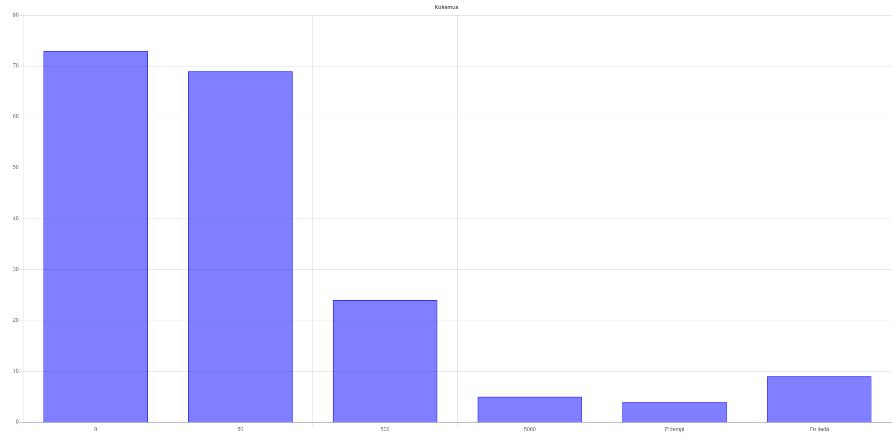

     1|---
     2|theme: slidev-theme-jyu
     3|addons:
     4|  - slidev-addon-polls
     5|title: "Ohjelmointi 1 – Luento 2"
     6|download: false
     7|favicon: https://jyu-polls.dezhidki-hermes.party/jyu-logo-cover.svg
     8|pollQr: "https://jyu-polls.dezhidki-hermes.party/vote.html"
     9|layout: cover
    10|---
    11|
    12|# Ohjelmointi 1 – Luento 2
    13|
    14|Integroitu kehitysympäristö, graafinen C#-ohjelma
    15|
    16|---
    17|
    18|# Luennon ohjelma
    19|
    20|- Ohjelmointi integroidussa kehitysympäristössä
    21|- C#-ohjelman perusrakenne
    22|- Jypeli: Rakennetaan lumiukko
    23|- Harjoitustehtävät 1
    24|- Kysymyksiä?
    25|
    26|---
    27|
    28|# Tarkennuksia eiliseen
    29|
    30|- Ajantasaiset ohjausten ajat näkyvissä kurssin etusivulla (https://tim.pm/ohj1)
    31|- Kaikkiin ohjauksiin saa tulla riippumatta siitä, minkä pääteohjausryhmän valitsit Sisussa
    32|- Jos haluat poistaa tai muuttaa ryhmiä Sisussa, laita viestiä it-studyaffairs@jyu.fi
    33|- Harjoitustyöaihetta voi alkaa miettiä; Katso Harjoitustyö-sivulla kohta 3.1 inspiraatiota varten
    34|
    35|---
    36|
    37|# Tarkennuksia eiliseen
    38|
    39|> Poiminta esikyselystä (s2025): Suurin kirjoitettu ohjelma ennen Ohj1
    40|
    41|
    42|
    43|---
    44|
    45|# Ohjelmointi integroidussa kehitysympäristössä
    46|
    47|- Toimivan tietokoneohjelman tuottamiseen kuuluu (1) koodin kirjoittaminen, (2) kääntäminen ja (3) ajaminen
    48|- Koko prosessi voidaan toteuttaa samassa paikassa nk. integroidussa kehitysympäristössä (engl. integrated development environment, IDE)
    49|  - Projektin luominen, koodin kirjoittaminen, virheiden jäljitys, kääntäminen, ajaminen
    50|  - Oheistiedostojen linkittäminen (kuvat, äänet, …)
    51|
    52|---
    53|
    54|# Ohjelmointi integroidussa kehitysympäristössä
    55|
    56|- Tämän kurssin IDE: JetBrains Rider
    57|  - Asennusohjeet: ohjelmointi1.it.jyu.fi/tyokalut
    58|  - Muita vaihtoehtoja voivat olla esim. Visual Studio ja VS Code
    59|
    60|> Demo: Luodaan “Hei maailma” -projekti Riderissa ja tutkitaan sen osia.
    61|
    62|---
    63|
    64|# Lähdekoodi
    65|
    66|- Lähdekoodi on tietokoneohjelman kuvaus
    67|  - Lähdekoodi noudattaa (jonkin) ohjelmointikielen syntaksia  (kielioppi, kirjoitussäännöt, ym.)
    68|- Koodi kirjoitetaan tyypillisesti ns. pelkkänä tekstinä (engl. plain text)
    69|  - Ohjelmat voivat koostua muustakin kuin tekstimuotoisesta lähdekoodista, vrt. esim. graafiset blokit Scratch-ympäristössä tai Blueprint  Unreal Engine -pelimoottorissa.
    70|- C#-kielessä lähdekoodi käännetään ajettavaksi ohjelmaksi kääntäjällä (engl. compiler)
    71|
    72|---
    73|
    74|# C#-ohjelman perusrakenne
    75|
    76|- C#-ohjelma koostuu vähintään yhdestä luokasta (engl. class)
    77|- Ohjelma alkaa pääohjelmasta (C#-kielessä Main)
    78|- Ohjelman keskiössä ovat perättäin suoritettavat lauseet (engl. statement)
    79|- Koodi voidaan ryhmitellä erilaisiin uudelleenkäytettäviin kokonaisuuksiin, C#:ssa mm.
    80|  - aliohjelma (engl. function, method)
    81|  - luokka (engl. class)
    82|  - nimiavaruus (engl. namespace)
    83|  - kirjasto (engl. library)
    84|
    85|---
    86|
    87|# Koodin kirjoittamisesta
    88|
    89|- Aaltosulkeiden sisällä oleva koodi “sisennetään” luettavuutta varten
    90|- Ohjelmakoodin lomaan voi kirjoittaa kommentteja sekä dokumentaatioita
    91|  - Koodin seassa olevat kommentit ovat itselle ja muille koodareille. Nämä kirjoitetaan // tai /* */ merkinnöillä
    92|  - Dokumentaatiokommentit kirjoitetaan ohjelman osien yläpuolelle käyttämällä /// merkintöjä ja ennalta määriteltyjä tageja
    93|- Koodin dokumentointi helpottaa koodin ymmärtämistä, ylläpitämistä ja uudelleenkäyttöä
    94|
    95|---
    96|
    97|# Esimerkki C#-ohjelmasta
    98|
    99|```csharp
   100|/// <summary>
   101|/// Tämä on ensimmäinen ohjelmani.
   102|/// </summary>
   103|public class HelloWorld
   104|{
   105|    /// <summary>
   106|    /// Tulostetaan tekstiä ruudulle.
   107|    /// </summary>
   108|    public static void Main()
   109|    {
   110|        System.Console.WriteLine("Moi maailma!");
   111|    }
   112|}
   113|```
   114|
   115|---
   116|
   117|# Jypeli
   118|
   119|- Jypeli on opintojaksolla käytössä oleva peliohjelmointikirjasto
   120|- Asennusohjeet: https://ohjelmointi1.it.jyu.fi/tyokalut
   121|- Jypeli-wiki: https://tim.pm/jypeli-wiki
   122|- Jypelin dokumentaatio: https://tim.pm/jypeli-docs
   123|
   124|> Demo: Rakennetaan lumiukko Jypelillä
   125|
   126|---
   127|
   128|# Mitä seuraavaksi?
   129|
   130|- Seuraavalla luennolla:
   131|  - Aliohjelmat (funktiot)
   132|  - Muuttujat
   133|- Kotitehtävät:
   134|  - Asenna tarvittavat työkalut: https://tim.pm/ohj1-tyokalut
   135|  - Tee Harjoitustehtävät 1
   136|
   137|<br>
   138|
   139|> Kysymyksiä? Kommentit TIMiin tai kysy ohjaajilta Teamsissa / pääteohjausajalla.
   140|